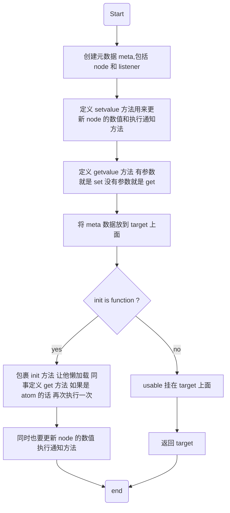

# 基本的API

-   use
-   create
-   effect
-   subscribe

# 和 React 绑定的 API

-   useSetup
-   useAtom

# 创建一个 atom 都干了啥

```tsx
const counter = create(3, (atom) => ({
  inc: () => atom((s) => s + 1),
  dec: () => atom((s) => s - 1)
}))
```

上面的代码展示了如何创建一个 atom 我们来看看 create 内部如何处理了传入的参数。

# create

```tsx
export function create(
  init,
  usable,
  enhancer
) {
  const meta = { notifier: createNotifier(), node: init }
  let isValid = true
  let evaluate
  const getValue = () => {
    if (!isValid) evaluate()
    return meta.node
  }

  const setValue = createSetValue(getValue, meta, enhancer)
  const target = createTarget(getValue, setValue)
  target[META] = meta

  if (typeof init === 'function') {
    isValid = false
    const { onCleanup, cleanupAll } = createCleanup()

    const getter = createGetState(() => {
      if (meta.notifier.listeners.size) evaluate()
      else isValid = false
    }, onCleanup)

    evaluate = () => {
      cleanupAll()
      const result = init(getter)
      isValid = true
      if (target() === result) return
      meta.node = result
      meta.notifier.notify()
    }
  }
  if (usable && typeof usable === 'function') target[USABLE] = usable(target)
  return target
}
```

```tsx
// 这里就创建了一个 set 然后 通知的时候，遍历执行所有的监听函数。
export const createNotifier = () => {
  const listeners = new Set<(value?: unknown) => void>()
  const notify = (value?: unknown) => listeners.forEach((listener) => listener(value))
  const subscribe = (listener: () => void) => {
    listeners.add(listener)
    return () => listeners.delete(listener)
  }
  return { listeners, notify, subscribe }
}
```

```tsx
// 这里定义了更新 value 的方法，然后更新的时候，通知所有的监听函数执行。
export const createSetValue = <T extends any>(getValue: () => T, meta: any, enhancer?: any) => {
  let setValue = (value: T) => {
    ;(meta as $Meta<T>).node = value
    meta.notifier.notify()
  }

  if (enhancer) setValue = enhancer(setValue)

  return (x: any) => {
    const nextValue = typeof x === 'function' ? x(getValue()) : x
    setValue(nextValue)
  }
}
```

```
// 定义了一个方法 有参数调用 set 没参数调用 get
export const createTarget = (get: Function, set: Function) => {
  return function xoid(x?: unknown) {
    return arguments.length === 0 ? get() : set(x)
  }
}
```

经过 `create`之后，将我们的穿进去的的数据包装了一下。

# init 是函数，经历了了啥

```tsx
export const createCleanup = () => {
  const fns = new Set<Function>()
  const onCleanup = (fn: Function) => void fns.add(fn)
  const cleanupAll = () => {
    fns.forEach((fn) => fn())
    fns.clear()
  }
  return { onCleanup, cleanupAll }
}

export function createReadable<T, U>(
  atom: Atom<T>,
  selector?: keyof T | ((state: T) => U)
): Atom<U> | Atom<T> {
  if (typeof selector === 'undefined') return atom
  const { fn } = parseSelector(selector)
  const ans = () => fn(atom())
  ;(ans as $A)[META] = (atom as $A)[META]
  return ans as any
}

export const createGetState =
  (updateState: Listener<unknown>, onCleanup: OnCleanup): GetState =>
  // @ts-ignore
  (atom, selectorOrSubscribe) => {
    if (!(atom as $A)[META]) {
      // if not a xoid atom, treat as external subscription
      onCleanup(selectorOrSubscribe(updateState))
      return atom()
    }
    const readable = createReadable(atom, selectorOrSubscribe)
    onCleanup(subscribe(readable, updateState))
    return readable()
  }
```



# 如何监听到数据的更新

```tsx
import { subscribe } from 'xoid'

const unsub = subscribe(
  atom,
  (state, previousState) => { console.log(state, previousState) }
)
```

```tsx
const subscribe  = (atom, fn) => {
  // cleanup + runCleanup
  let cleanup
  const runCleanup = () => {
    if (cleanup && typeof cleanup === 'function') cleanup()
    cleanup = undefined
  }
  let prevValue = atom()
  const listener = () => {
    const nextValue = atom()
    if (nextValue !== prevValue) {
      runCleanup()
      cleanup = fn(nextValue, prevValue)
      prevValue = nextValue
    }
  }
  if (effect) cleanup = fn(prevValue, prevValue)
  const unsub = atom[META].notifier.subscribe(listener)
  return () => {
    runCleanup()
    unsub()
  }
}
```

在初始化 `subscribe`的时候，会在函数内部形成一个闭包，缓存当前 `atom`的值，然后在 `notify`的时候，会进行比较，如果两次的数值不一样的话，就执行这个 `listener`

# 如何与 React 绑定起来

# useAtom

```tsx
export function useAtom<T, U>(atom: Atom<T>, selector?: keyof T | ((state: T) => U)): any {
  const readable = useMemo(() => createReadable(atom as Atom<T>, selector), [atom, selector])
  const result = useSyncExternalStore(
    (readable as any)[META].notifier.subscribe,
    readable,
    readable
  )
  useDebugValue(result)
  return result
}
```

# useSetup

```tsx
export function useSetup(setupFn: (deps: any, onCleanup: any) => any, props?: any): any {
  const $deps = useConstant(() => create(() => props))
  useIsoLayoutEffect(() => $deps(() => props), [props])
  const onCleanup = useCleanup()
  return useConstant(() => setupFn($deps, onCleanup))
}
```

# 其他

**useSyncExternalStore** 单独写一篇文章介绍。